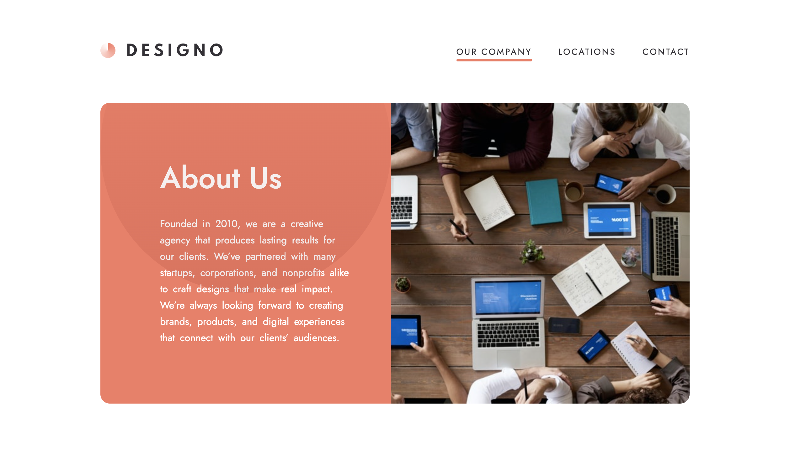

# Frontend Mentor - Designo agency website solution

This is a solution to the [Designo agency website challenge on Frontend Mentor](https://www.frontendmentor.io/challenges/designo-multipage-website-G48K6rfUT)

## Table of contents

- [Overview](#overview)
  - [The challenge](#the-challenge)
  - [Screenshot](#screenshot)
  - [Links](#links)
- [My process](#my-process)
  - [Built with](#built-with)
  - [What I learned](#what-i-learned)
  - [Continued development](#continued-development)
  - [Useful resources](#useful-resources)
- [Author](#author)

## Overview

### The challenge

Users should be able to:

- View the optimal layout for each page depending on their device's screen size
- See hover states for all interactive elements throughout the site
- Receive an error message when the contact form is submitted if:
  - The `Name`, `Email Address` or `Your Message` fields are empty should show "Can't be empty"
  - The `Email Address` is not formatted correctly should show "Please use a valid email address"

### Screenshot



### Links

- Live Site URL: [Designo](https://designo-eight.vercel.app/)

## My process

### Built with

- Semantic HTML5 markup
- CSS custom properties
- Flexbox
- CSS Grid
- [React](https://reactjs.org/) – JavaScript library for building UIs
- [React Router](https://reactrouter.com/) – page navigation
- [Tailwind CSS](https://tailwindcss.com/) – utility-first CSS framework
- [Formik](https://formik.org/) – form state management
- [Yup](https://github.com/jquense/yup) – form validation

### What I learned

This project helped me improve at structuring multi-page React apps and applying responsive layouts with Tailwind.
One of the features I implemented was a custom `ScrollToTop` component.  
Instead of instantly jumping to the top on route change, I added a smooth scroll with a **Framer Motion transition bar** that animates across the screen, giving feedback during navigation.

```jsx
import { useEffect, useState } from "react";
import { useLocation } from "react-router";
import { motion, AnimatePresence } from "framer-motion";

const ScrollToTop = () => {
  const { pathname } = useLocation();
  const [isTransitioning, setIsTransitioning] = useState(false);

  useEffect(() => {
    setIsTransitioning(true);

    const timeout = setTimeout(() => {
      window.scrollTo({ top: 10, behavior: "smooth" });
      setIsTransitioning(false);
    }, 400);

    return () => clearTimeout(timeout);
  }, [pathname]);

  return (
    <AnimatePresence>
      {isTransitioning && (
        <motion.div
          key={pathname}
          initial={{ scaleX: 0 }}
          animate={{ scaleX: 1 }}
          exit={{ scaleX: 0 }}
          transition={{ duration: 0.4, ease: "easeInOut" }}
          className="fixed top-0 left-0 right-0 h-1 bg-gray-900 origin-left z-[9999]"
        />
      )}
    </AnimatePresence>
  );
};

export default ScrollToTop;
```

## Author

- Website - [Maria Sidorova](https://portfolio-6dft.vercel.app/)
- Frontend Mentor - [@SidorovaMaria](https://www.frontendmentor.io/profile/SidorovaMaria)
