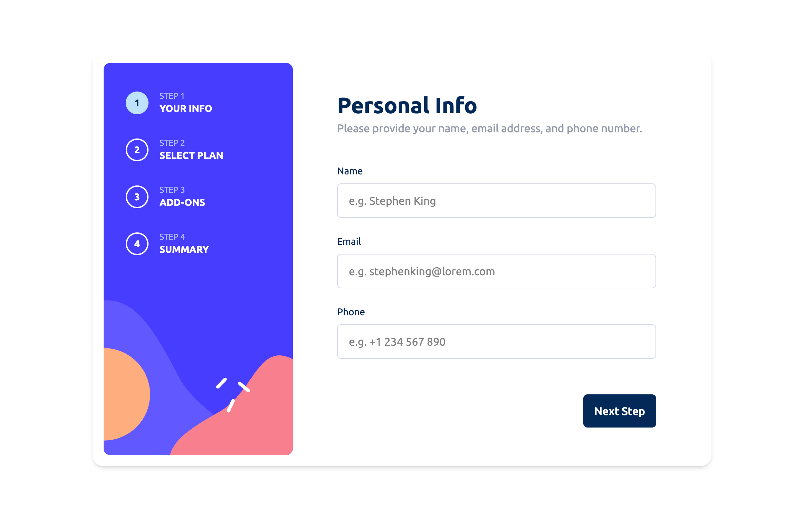

# Frontend Mentor - Multi-step form solution

This is a solution to the [Multi-step form challenge on Frontend Mentor](https://www.frontendmentor.io/challenges/multistep-form-YVAnSdqQBJ).

## Table of contents

- [Overview](#overview)
  - [The challenge](#the-challenge)
  - [Screenshot](#screenshot)
  - [Links](#links)
- [My process](#my-process)
  - [Built with](#built-with)
  - [What I learned](#what-i-learned)
- [Author](#author)

**Note: Delete this note and update the table of contents based on what sections you keep.**

## Overview

### The challenge

Users should be able to:

- Complete each step of the sequence
- Go back to a previous step to update their selections
- See a summary of their selections on the final step and confirm their order
- View the optimal layout for the interface depending on their device's screen size
- See hover and focus states for all interactive elements on the page
- Receive form validation messages if:
  - A field has been missed
  - The email address is not formatted correctly
  - A step is submitted, but no selection has been made

### Screenshot



### Links

- Live Site URL: [Vercel](https://multi-step-form-eight-snowy.vercel.app/)

## My process

### Built with

- [React](https://reactjs.org/) – UI library
- [Formik](https://formik.org/) – form handling
- [Yup](https://github.com/jquense/yup) – form validation
- [Tailwind CSS](https://tailwindcss.com/) – styling
- [Motion](https://motion.dev/) – animations and transitions
- [Vite](https://vitejs.dev/) – build tool
- TypeScript – static typing

**Note: These are just examples. Delete this note and replace the list above with your own choices**

### What I learned

This project helped me solidify my understanding of **TypeScript in React state management**.  
I designed a strongly typed global store using **Zustand** with clear typing for each step in the form.

Here’s the `StepState` type I implemented:

```ts
type StepState = {
  step: number;
  isConfirmed: boolean;
  setIsConfirmed: (bool: boolean) => void;
  increaseStep: (step?: number) => void;
  decreaseStep: (step?: number) => void;
  formData: {
    name: string;
    email: string;
    phone: string;
    billingTime: string;
    price: number;
    plan: string;
    addOns: { addOn: string; price: number }[];
  };
  updateFormData: (data: Partial<StepState["formData"]>) => void;
};
```

This taught me to:

- Use Partial<T> to allow flexible form updates.
- Create clear type-safe contracts for global state.
- Combine form handling (Formik) with strongly typed global state (Zustand) for predictable flows.

### Useful resources

- [TypeScript Utility Types](https://www.typescriptlang.org/docs/handbook/utility-types.html) – helped me understand and use `Partial<T>` effectively for flexible form updates.
- [Formik + Yup Guide](https://formik.org/docs/guides/validation) – clarified how to structure validation schemas and combine them with React forms.

## Author

- Website - [Maria Sidorova](https://portfolio-6dft.vercel.app/)
- Frontend Mentor - [@SidorovaMaria](https://www.frontendmentor.io/profile/SidorovaMaria)
