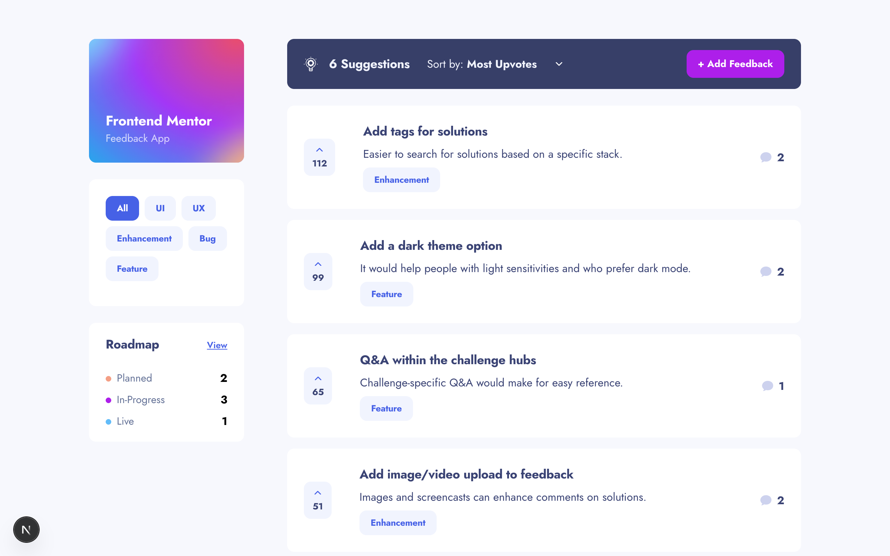
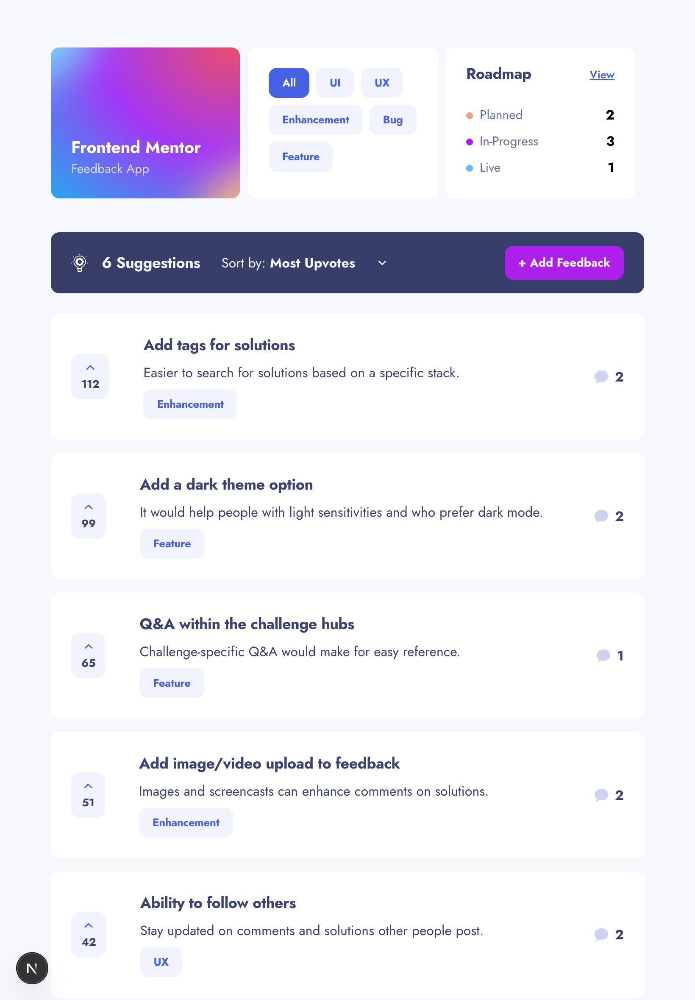
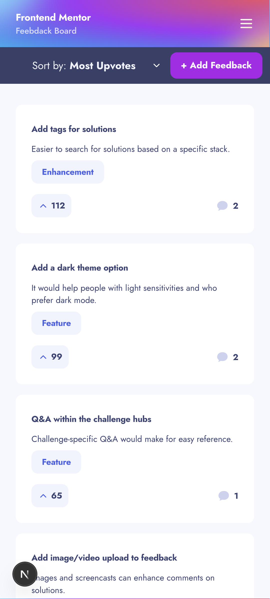

# Frontend Mentor - Product feedback APP ( Next.js + json-server )

This is a solution to the [Product feedback app challenge on Frontend Mentor](https://www.frontendmentor.io/challenges/product-feedback-app-wbvUYqjR6).
A full CRUD mock of the Product Feedback app. Next.js (App Router) on the UI, `json-server` as a local API. Zero backend ceremony; maximum iteration speed.

## Table of contents

- [Overview](#overview)
- [Tech Stack](#tech-stack)
- [Local Setup](#local-setup)
- [Data Model](#data-model)
- [Screenshot](#screenshot)
- [Links](#links)
- [What I Learned](#what-i-learned)

## Overview

Users can:

- Enjoy responsive layouts + keyboard-friendly UI
- Create, read, update, and delete feedback requests
- See hover states for all interactive elements on the page
- Receive form validations when trying to create/edit feedback requests
- Sort suggestions by most/least upvotes and most/least comments
- Filter suggestions by category
- Add comments and replies to a product feedback request

### Tech Stack

- **Next.js 14+** (App Router, RSC, Turbopack)
- **TypeScript**
- **Tailwind**
- **Radix UI** (accessible primitives: Select,Button)
- **json-server** (mock REST API)

### Local Setup

`````bash
# 1) install deps
npm i

# 2) copy env and adjust if needed
cp .env.example .env.local

# 3) run dev UI + mock API together
npm run start

```

### Data Model
````json
{
  "currentUser": {
    "image": "./assets/user-images/image-zena.jpg",
    "name": "Zena Kelley",
    "username": "velvetround",
  },
  "productRequests": [
    {
      "id": "1",
      "title": "Add tags for solutions",
      "category": "enhancement",
      "upvotes": 112,
      "status": "suggestion",
      "description": "Easier to search...",
      "comments": [],
      "upvotedByCurrentUser": false,
    }
  ]
}
`````

### Screenshot





### Links

- Github URL: [Add solution URL here](https://github.com/SidorovaMaria/FrontEndMentor/tree/main/Guru/p-feedback)
- Live Site URL: [Add live site URL here](https://your-live-site-url.com)

### What I learned

- 🧩 Advanced Reusable UI components
  Practiced creating flexible, theme-aware components (like Button, Badge, Select) using shadcn/ui patterns combined with Radix UI primitives. Learned how to wire up variants with class-variance-authority (CVA) for consistent styling.
- 🗄️ Mock APIs with json-server
  Built a full CRUD layer with json-server as a backend stand-in. Learned how to properly use PATCH vs PUT, keep data flat (avoiding nested { item: {…} } bugs), and reset the DB quickly with seed data.
- ♿ Accessibility best practices
  Added aria-labelledby, aria-describedby, aria-live, and aria-pressed for dynamic elements.
  Made tabs keyboard-navigable (Arrow keys + Home/End).
  Ensured Radix Select works with keyboard (Up/Down/Enter/Escape).
  Preserved focus styles instead of removing outlines.
- Combined Next.js dev server + json-server with concurrently so both run in one command.

I little code snippet I'm proud of:

- Istead of repeating fetch logic everywhere, it centralizes API calls into one clean resubale function. Enforces type safety with generic <T>. Also gives me instant feedback when something goes wrong. Writing this taught me how to think about clean abstractions and making my codebase easier to scale.

```ts
// A reusable, strongly typed fetch wrapper I'm proud of
async function api<T>(url: string, init?: RequestInit): Promise<T> {
  const res = await fetch(url, init);
  if (!res.ok)
    throw new Error(`${init?.method ?? "GET"} ${url} failed: ${res.status}`);
  return (await res.json()) as T;
}
```

### Useful resources

- [Radix UI – Select](https://www.radix-ui.com/themes/docs/components/select)  
  Helped me set up accessible, keyboard-navigable dropdowns with great customization options.

- [Radix UI – Badge](https://www.radix-ui.com/themes/docs/components/badge)  
  I used this to build reusable and styled badges, which improved consistency across my app.

- [Radix UI – Button](https://www.radix-ui.com/themes/docs/components/button)  
  Great reference for building accessible, flexible buttons with different states.

- [json-server](https://github.com/typicode/json-server)  
  Super useful for mocking a backend API and practicing CRUD operations without needing a full server setup.

## Author

- Website - [Maria Sidorova](https://portfolio-6dft.vercel.app)
- Frontend Mentor - [@SidorovaMaria](https://www.frontendmentor.io/profile/SidorovaMaria)
