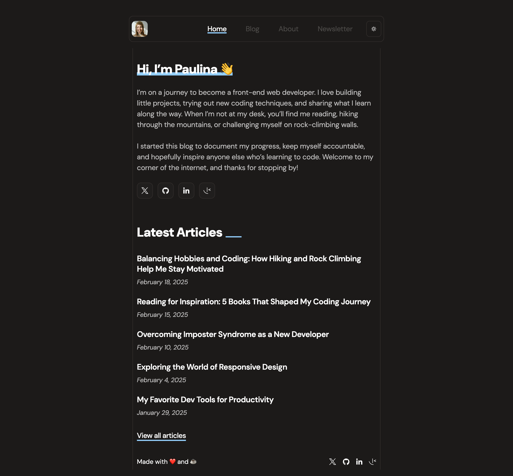

# Frontend Mentor - Personal blog solution

This is a solution to the [Personal blog challenge on Frontend Mentor](https://www.frontendmentor.io/challenges/personal-blog-lJpVCnmozL).

## Table of contents

-   [Overview](#overview)
    -   [The challenge](#the-challenge)
    -   [Screenshot](#screenshot)
-   [My process](#my-process)
    -   [Built with](#built-with)

### The challenge

Users should be able to:

-   Navigate to all pages by clicking links or using their keyboard
-   Read all articles
-   Select their color theme
-   Submit their email to subscribe to the newsletter
-   Receive an error message when the newsletter form is submitted if:
    -   The Email Address field is empty
    -   The Email Address is not formatted correctly
-   Receive a success message if submitted correctly
-   View the optimal layout for the interface depending on their device's screen size
-   See hover and focus states for all interactive elements on the page

### Screenshot

### Built with

-   Semantic HTML5 markup
-   CSS custom properties
-   Flexbox
-   Mobile-first workflow
-   [React](https://reactjs.org/) - JS library
-   TailwindCSS v4
-   Formik
-   react-markdown
-   yup
