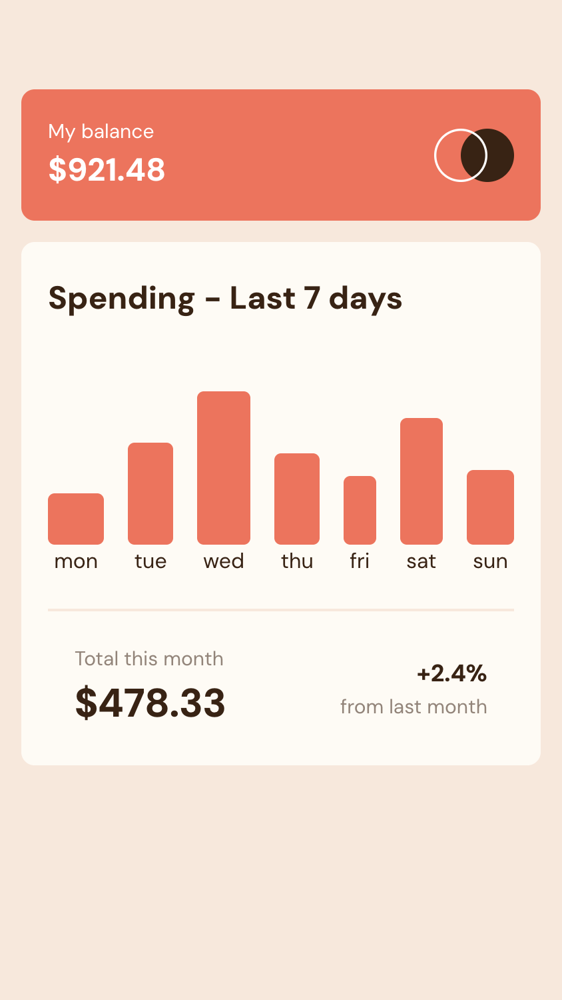

# Frontend Mentor - Expenses chart component solution

This is a solution to the [Expenses chart component challenge on Frontend Mentor](https://www.frontendmentor.io/challenges/expenses-chart-component-e7yJBUdjwt).

## Table of contents

- [Overview](#overview)
  - [The challenge](#the-challenge)
  - [Screenshot](#screenshot)
  - [Links](#links)
- [My process](#my-process)
  - [Built with](#built-with)
- [Author](#author)

## Overview

### The challenge

Users should be able to:

- View the bar chart and hover over the individual bars to see the correct amounts for each day
- See the current day’s bar highlighted in a different colour to the other bars
- View the optimal layout for the content depending on their device’s screen size
- See hover states for all interactive elements on the page
- **Bonus**: Use the JSON data file provided to dynamically size the bars on the chart

### Screenshot

### Links

- Live Site URL: [Github Preview](https://htmlpreview.github.io/?https://github.com/SidorovaMaria/FrontEndMentor/blob/presentability/Junior/expenses-chart-component-main/index.html)

## My process

### Built with

- Semantic **HTML5** markup
- **CSS custom properties**
- **Flexbox** and **CSS Grid**
- **Mobile-first** workflow
- Vanilla **JavaScript** for interactivity

### What I learned

This project was a great exercise in handling **component state without frameworks**. I learned how to:

- Manage selected states for rating buttons using JavaScript
- Add accessible focus and hover styles for better UX
- Dynamically update the "Thank you" card with the selected rating

## Author

- Website - [Maria Sidorova](https://portfolio-6dft.vercel.app/)
- Frontend Mentor - [@SidorovaMaria](https://www.frontendmentor.io/profile/SidorovaMaria)
