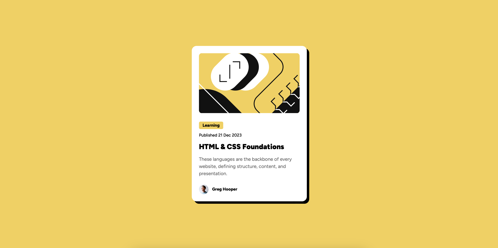

# Frontend Mentor - Blog preview card solution

This is a solution to the [Blog preview card challenge on Frontend Mentor](https://www.frontendmentor.io/challenges/blog-preview-card-ckPaj01IcS).

## Table of contents

-   [Overview](#overview)
    -   [The challenge](#the-challenge)
    -   [Screenshot](#screenshot)
    -   [Links](#links)
-   [My process](#my-process)
    -   [Built with](#built-with)
    -   [Useful Resources](#useful-resources)

**Note: Delete this note and update the table of contents based on what sections you keep.**

## Overview

### The challenge

Users should be able to:

-   See hover and focus states for all interactive elements on the page.
-   View the blog preview card with a responsive design on various screen sizes.

### Screenshot

### Links

- Live Site URL: [Github Preview](https://htmlpreview.github.io/?https://github.com/SidorovaMaria/FrontEndMentor/blob/main/Newbie/blog-preview-card-main/index.html)

### Built with

-   Semantic HTML5 markup
-   CSS custom properties
-   Flexbox
-   CSS hover effects for better user interaction

### Useful Resources

-   MDN Web Docs – Great for CSS and HTML best practices.
-   CSS Tricks – Helpful for flexbox and hover effect tips.
