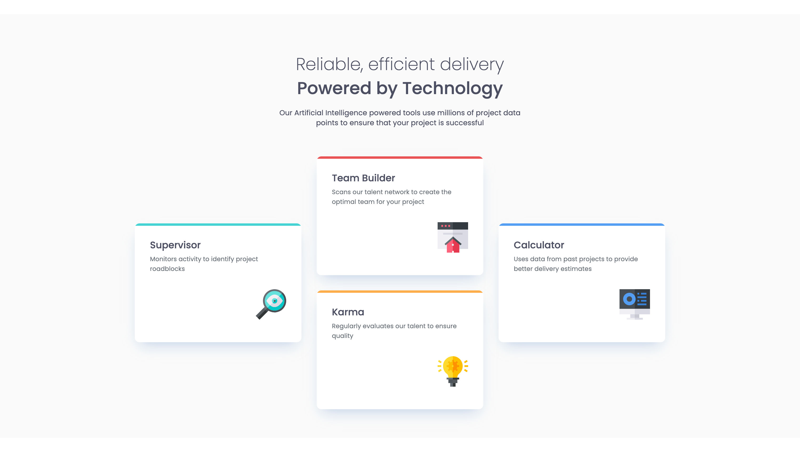

# Frontend Mentor - Four card feature section solution

This is a solution to the [Four card feature section challenge on Frontend Mentor](https://www.frontendmentor.io/challenges/four-card-feature-section-weK1eFYK).

## Table of contents

-   [Overview](#overview)
    -   [Links](#links)
    -   [The challenge](#the-challenge)
    -   [Screenshot](#screenshot)

-   [My process](#my-process)
    -   [Built with](#built-with)

**Note: Delete this note and update the table of contents based on what sections you keep.**

## Overview

### The challenge

Users should be able to:

-   View the optimal layout for the site depending on their device's screen size

### Links

- Live Site URL: [Github Preview](https://htmlpreview.github.io/?https://github.com/SidorovaMaria/FrontEndMentor/blob/main/Newbie/four-card-feature-section-master/index.html)
- 
### Screenshot

## My process

### Built with

-   Semantic HTML5 markup
-   CSS custom properties
-   Flexbox
-   CSS Grid
-   Mobile-first workflow
