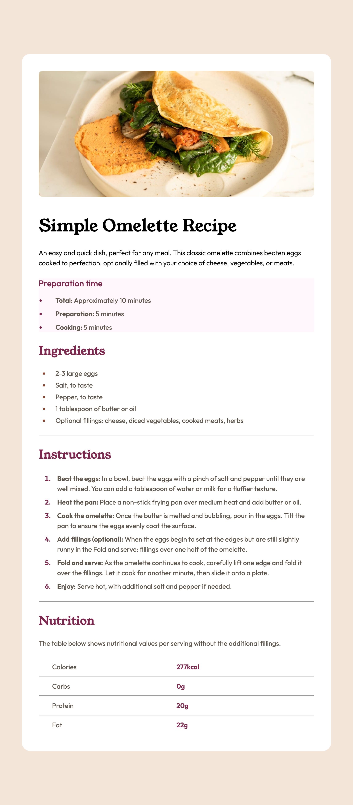

# Frontend Mentor - Recipe page solution

This is a solution to the [Recipe page challenge on Frontend Mentor](https://www.frontendmentor.io/challenges/recipe-page-KiTsR8QQKm).

## Table of contents

-   [Overview](#overview)
    -   [Links](#links)
    -   [Screenshot](#screenshot)
-   [My process](#my-process)
    -   [Built with](#built-with)

## Overview

### Links

- Live Site URL: [Github Preview](https://htmlpreview.github.io/?https://github.com/SidorovaMaria/FrontEndMentor/blob/main/Newbie/recipe-page-main/index.html)

### Screenshot

### Built with

-   Semantic HTML5 markup
-   CSS custom properties
-   Flexbox
-   CSS Grid
-   Mobile-first workflow
-   Cascading CSS
